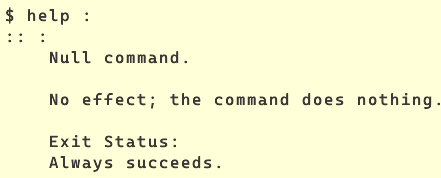

= null “:” command
:page-subject: Bash
:page-tags: bash null command shell command-line

== Intro

.help on ‘:’ null bash built-in command
[source,text]
----
$ help :
:: :
    Null command.

    No effect; the command does nothing.

    Exit Status:
    Always succeeds.
----
