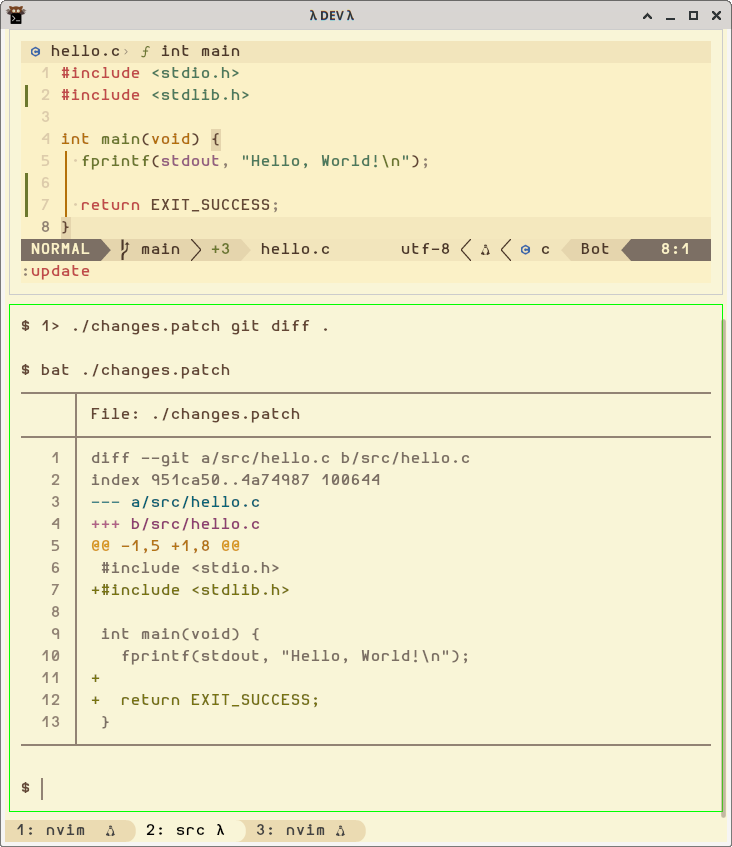

= Patch and Git Patch
:page-subject: Command Line
:page-tags: patch git command-line diff

== Create and apply a patch with git

Create the patch from a simple `git diff` and save to a file:

[source,shell-session]
----
$ 1> ./changes.patch git diff .
$ cat ./changes.patch
----

And it would result in something like this:

[source,diff]
----
diff --git a/src/hello.c b/src/hello.c
index 951ca50..4a74987 100644
--- a/src/hello.c
+++ b/src/hello.c
@@ -1,5 +1,8 @@
 #include <stdio.h>
+#include <stdlib.h>

 int main(void) {
   fprintf(stdout, "Hello, World!\n");
+
+  return EXIT_SUCCESS;
 }
----

Now, that `.patch` is sent to someone else who wants to apply the patch, use `git apply`:

[source,shell-session]
----
$ git apply changes.patch
----