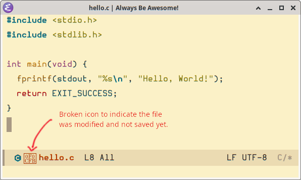
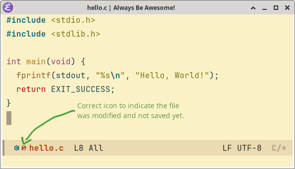

= Emacs Mode Line
:page-tags: emacs mode-line

== Broken save icon

Depending on the font used, Emacs may display a “broken” save icon on the mode line:

Try different fonts.
For example, this is what I have in my `init.el` as of now:

[source,elisp]
----
;;;;
;; Find fonts with fc-list & grep. Examples:
;;
;;   $ fc-list : family | grep -i mono
;;   $ fc-list : family | grep -i nerd
;;   $ fc-list : family | grep -i '\(hurmit\|hermit\|source\|sauce\)'
;;
(cond
  ((eq system-type 'gnu/linux)
    (set-face-attribute
      'default nil
      :family "JetBrainsMono Nerd Font"
      ;family "Hurmit Nerd Font Mono"
      ;:family "BlexMono Nerd Font"
      ;:family "SpaceMono Nerd Font Mono"
      ;:family "Source Code Pro"
      :height 120
      :width 'normal
      :weight 'normal))
  ((eq system-type 'darwin)
    (set-face-attribute
      'default nil
      :family "SauceCodePro Nerd Font Mono"
      :height 145
      :width 'expanded
      ;:weight 'semibold
      )))
----

With point anywhere inside the `set-face-attribute` expression or even anywhere inside the `cond`, simply press kbd:[C-M-x], or kbd:[M-x eval-defun RET] to try different fonts on the fly.

Here's when the font supports the save icon correctly:

