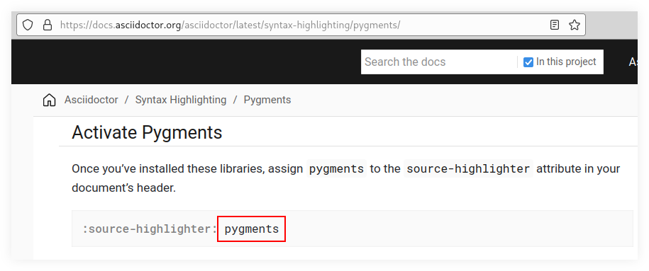

= AsciiDoc & Asciidoctor
:description: Notes, tips and examples on AsciiDoc and Asciidoctor
:pp: {plus}{plus}
:page-tags: ["asciidoc", "asciidoctor", "markup"]
:favicon: https://fernandobasso.dev/cmdline.png
:icons: font
:sectlinks:
:sectnums!:
:toclevels: 6
:toc: left
:experimental:
:source-highlighter: highlight.js
:stem: latexmath
ifdef::env-github[]
:tip-caption: :bulb:
:note-caption: :information_source:
:important-caption: :heavy_exclamation_mark:
:caution-caption: :fire:
:warning-caption: :warning:
endif::[]

== Introduction

AsciiDoc is the best non-html-like markup language.
It is as simple as Markdown for the simple things, while also offering way more useful, powerful and advanced features when needed.

* https://docs.asciidoctor.org/asciidoctor/latest/install/[AsciiDoc (Ruby)]
* https://github.com/nlopes/acdc[ACDC - AsciiDoc Parser & Converter (Rust)]

== Editors

See link:../editors/emacs/emacs-loves-asciidoc.adoc[Emacs Loves AsciiDoc].

== Preview current .adoc file in the browser

Install the https://addons.mozilla.org/en-US/firefox/addon/asciidoctorjs-live-preview/[Asciidoctor.js Live Preview^] extension so that the browser can open any `.adoc` file and render its AsciiDoc automatically.

Then, in [n]vim, simply run:

[source,text]
----
:!firefox %
----

In VS Code, kbd:[Ctrl+Shift+P] and “File: Copy Path of Active File” to copy the _absolute_ path of the active file, and then simply paste it into the address bar of the browser in which Asciidoctor.js Live Preview extension has been installed.

[NOTE]
====
Looks like (as of 2026), we cannot  make `include::foo.adoc[]` or `docinfo` files work with the extension.
It seems to only handle single-file documents.
====

Many other ways to preview, very well written and documented:

* https://mrduguo.github.io/asciidoctor.org/docs/editing-asciidoc-with-live-preview/

== Convert Markdown to AsciiDoc

To convert from Markdown to AsciiDoc, use kramdown.
It is better suited than pandoc as it has more AsciiDoc-sensible options.

[,bash]
----
$ gem install kramdown kramdown-asciidoc

$ for file in ./*.md ; do
    kramdoc \
      --format=GFM \
      --output="${file%.md}.adoc" \
      --wrap=ventilate "$file"
  done

$ rm -vi ./*.md
----

Or, if you want to convert all `.md` to `.adoc` in a given directory, a script like this will help, and handles sub-directories:

[,shell]
----
#!/usr/bin/bash

##
# filename: to_adoc.sh
#
# $ gem install kramdown kramdown-asciidoc
##

find . -name '*.md' -exec bash -c '
  echo "Converting $1..."
  kramdoc \
    --format=GFM \
    --output="${1%.md}.adoc" \
    --wrap=ventilate "$1"
' bash {} \;
----

Then run it: `bash ./to_adoc.sh`.

== Convert AsciiDoc to Markdown

* https://github.com/opendevise/downdoc

In short:

[,bash]
----
$ npx downdoc -o ./intro.md ./intro.adoc
----

== Insert filename as title

[,bash]
----
##
# Create an array of all .adoc files.
#
mapfile -d $'\0' adocs < <(find . -name '*.adoc' -print0)

##
# Get the filename (without extension) and make it the title
# of the AsciiDoc file. For example: foo/bar/Jedi Tux.adoc will be
# inserted the “= Jedi Tux” title AsciiDoc title on line 1.
#
for adoc in "${adocs[@]}" ; do
  file="${adoc##*/}"
  title="${file%.*}"

  sed -i "1 i= $title\\
  :favicon: https://fernandobasso.dev/cmdline.png\\
  :icons: font\\
  :sectlinks:\\
  :sectnums!:\\
  :toclevels: 6\\
  :source-highlighter: highlight.js\\
  :experimental:\\
  :stem: latexmath\\
  :toc: left\\
  :imagesdir: __assets\\
  ifdef::env-github[]\\
  :tip-caption: :bulb:\\
  :note-caption: :information_source:\\
  :important-caption: :heavy_exclamation_mark:\\
  :caution-caption: :fire:\\
  :warning-caption: :warning:\\
  endif::[]" $file
done
----

== Source Highlighter

Add this attribute to the document:

[source,text]
----
= My Title
:toc: left
...
:source-highlighter: <which highlighter to use>
----

As of 2023, the docs currently say for pygments we simply write `pygments`.

but I got an error with this:

[source,text]
----
= My Title
:toc: left
...
:source-highlighter: pygments
----

[,shell-session]
----
$ asciidoctor ./algds/other/prime_factors/README.adoc
asciidoctor: WARNING: optional gem 'pygments.rb' is not available (reason: cannot load 'pygments'). Functionality disabled.
----

But if I changing to `pygments.rb` works:

[source,text]
----
= My Title
:toc: left
...
:source-highlighter: pygments.rb
----

=== Source Highlighter Not Working

We have observed at times that if `asciidoctor` is installed from a `Gemfile` and `pygments.rb` is installed with `gem install`, it may fail (with no errors) to add the tags around the code tokens.

Installing everything from `Gemfile` and then running `bundle exec asciidoctor file.adoc` worked.

One can preview AsciiDoc rendered document in many ways, including editors, browser extensions, or on Gitlab, Github, and probably other services as well.

* https://addons.mozilla.org/en-US/firefox/addon/asciidoctorjs-live-preview/[Asciidoctor.js live preview addon for Firefox].

== Writing Best Practices

Do follow the https://asciidoctor.org/docs/asciidoc-recommended-practices/#one-sentence-per-line[one sentence per line] approach.

== Tags

Discussion on antora.zulipchat.com:

* https://antora.zulipchat.com/#narrow/channel/282400-users/topic/Tagging.20Content/with/305558072[#users > Tagging Content]

For the whole document use:

[source,text]
----
= Doc Title
:page-tags: tag1 tag2
----

To add tags to a specific section, there is no mechanism to do that currently.
However, you could use roles that either start with tag- or are understood to be tags:

[source,text]
----
[.tag-foo.tag-bar.tag-baz]
== Intro
----

And something Dan Allen hopes to get into the language spec is `data-tags`:

[source,text]
----
[data-tags="foo bar baz"]
== Intro
----

[,Dan Allen]
____
I like this approach rather than yet another built-in attribute.
That's because one person will want tags, then someone will want categories, then someone will want subjects, then someone will want authors, and the list goes on...

So having a generic data passthrough facility I think is the right approach.
____

And we can have additional attributes on a block:

[source,text]
----
[tags="foo bar baz"]
== Intro
----

But for them to have any effect, we'd need to extend the HTML convert.

=== Ventilated Prose (aka "`one sentence per line`")

Don't wrap text at a fixed column width.
Instead, put each sentence on its own line, a technique called sentence per line.
This technique is similar to how you write and organize source code.
The result can be spectacular.

Here are some of the advantages of using the sentence per line style:

* It prevents reflows (meaning a change early in the paragraph won't cause the remaining lines in the paragraph to reposition).
* You can easily swap sentences.
* You can easily separate or join paragraphs.
* You can comment out sentences or add commentary to them.
* You can spot sentences which are too long or sentences that vary widely in length.
* You can spot redundant (and thus mundane) patterns in your writing.

We picked up this idea from the writing guide in the Neo4j documentation.
However, it seems like the idea dates back a discovery by Buckminster Fuller in the 1930s, who called it https://vanemden.wordpress.com/2009/01/01/ventilated-prose/[ventilated prose].
The technique was also recommended in 2009 by Brandon Rhodes in a blog post about https://rhodesmill.org/brandon/2012/one-sentence-per-line/[semantic linefeeds].

It's important to note that this technique works because AsciiDoc doesn't treat wrapped lines in prose as hard line breaks.
At least, it doesn't show up that way to the reader.
The line breaks between contiguous lines of prose will not be visible in the rendered document (i.e., as the reader sees it).
While a single line break doesn't appear in the output, two consecutive line breaks starts a new paragraph (or other block).

== Disable code-block italic fonts

Asciidoctor can produce output documents with nice source code syntax highlighting using an external source highlighter (Pygments, Highlight.js, etc.).

See:

* https://docs.asciidoctor.org/asciidoc/latest/verbatim/source-blocks/[Source Code Blocks on the Asciidoctor documentation].
* https://docs.asciidoctor.org/asciidoc/latest/verbatim/source-highlighter/[Source Highlighting on the Asciidoctor documentation].

____
[!NOTE] The tips that follow assume we are generating HTML output from our Asdiidoctor documents.
____

Most source highlighter programs style certain tokens in the source listings as italic.
Some people (like myself) prefers no italics in source code.

To disable italics completely for comments, keywords, identifiers, etc., we have to know which CSS classes are applied and override them.

Basically, create a passthrough block at the end of your `.adoc` file as in the examples below.

____
[!NOTE] The approach below will work if you are previewing Asciidoctor documents locally on a browser (with the preview extension), or if you generate the HTML with `asciidoctor` command line locally.

That said, it is unclear that Gitlab, Github or other platforms will apply our style overrides.
Probably not.
____

=== Disable italic for source code listings

Below are some selectors to disable italics for at least some source code highlighting tools, like Pygments and Highlight.js.

[source,text]
----
++++

++++
----

== Keyboard macros

For chord-like keyboard shortcuts[1] (common in editors like Emacs, Vim, and IDEs in general) in which sequences of key presses are often common, the recommended approach is to group each sequence of key presses inside their own pass:[kbd:[key]`]

|===
|Shortcut |Purpose

|kbd:[Ctrl+x] kbd:[Ctrl+f]
|Emacs find file

|kbd:[Ctrl+r] kbd:[f]
|Vim insert mode, paste te contents of the register kbd:[f] into the buffer
|===

== Chords

For key combinations that mix chords (simultaneous presses) with sequential keys (common in editors like Emacs and Vim), separate each step into its own `kbd:[]` macro separated by a space.

Think of these like a musical arpeggio: a distinct key chord followed by a sequence of single notes.

[NOTE]
====
While it is customary to uppercase alpha keys for readability, modal editors like Vim are strictly case-sensitive.
In the examples below, literal keys that must be pressed without kbd:[Shift] are kept lowercase.
====

|===
|Shortcut |Purpose

|kbd:[Ctrl+X] kbd:[Ctrl+F]
|Emacs find file sequence (Two successive chords).

|kbd:[Ctrl+R] kbd:[f]
|Vim Insert mode sequence: Presses the kbd:[Ctrl+R] chord, followed by the literal lowercase kbd:[f] key to paste the contents of register `f`.
|===

== My preferred Asciidoctor style overrides

image::../__assets/hackers-black-terminals-with-green-font-colors-2.png[Black use black terminals with green font colors]

Even though I use Arch Linux since 2009, I love Ubuntu fonts.
Also, I cannot stand seeing italics in code; not for reserved words, comments, or anything else.
No italic fonts for code!

[source,text]
----
++++

++++
----

[quote, John Nunemaker]
____
But we are hackers and hackers have black terminals with green font colors.
...
____

[quote, Fernando Basso]
____
...And no italic fonts.
____
