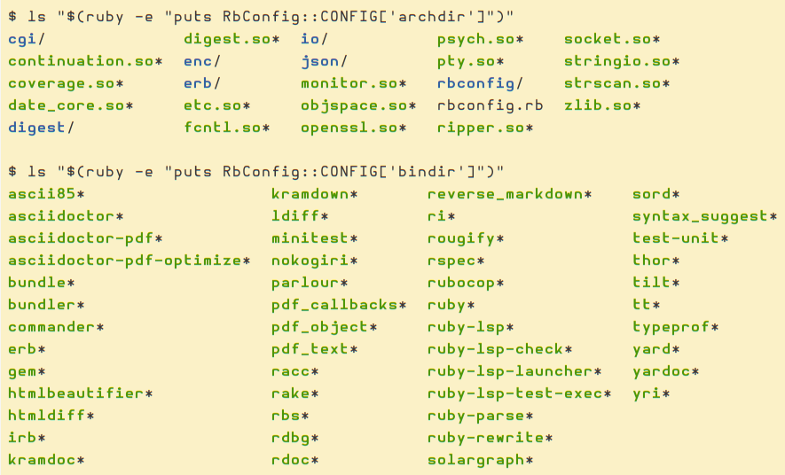

= Ruby Installation Information
:page-tags: ruby info install

== RbConfig module

The `RbConfig` module reveals a lot of information about the ruby installation.
Try these commands:

[source,shell-session]
----
$ ruby -e 'pp RbConfig::CONFIG'
$ ruby -e "puts RbConfig::CONFIG['archdir']"
$ ls "$(ruby -e "puts RbConfig::CONFIG['archdir']")"

$ ruby -e "puts RbConfig::CONFIG['bindir']"
$ ls "$(ruby -e "puts RbConfig::CONFIG['bindir']")"
----

Sample from my system with ruby 4 on Arch Linux on 2026:

=== References

* https://docs.ruby-lang.org/en/master/RbConfig.html
