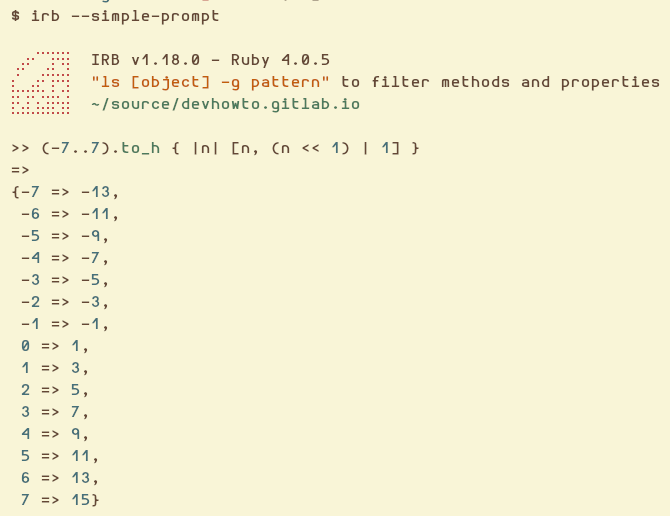

= Ruby Object IDs
:page-tags: ruby object id

== Intro

Object IDs are an important and interesting topic in ruby 🙂.

== Integer object_id

Take a look at these object IDs, from -7 to 7:

.irb session
[source,text]
----
>> (-7..7).map { |n| n.object_id }
=> [-13, -11, -9, -7, -5, -3, -1, 1, 3, 5, 7, 9, 11, 13, 15]
----

Note how we always get odd numbers (never an even number).
What is going on here?

Any given value in ruby is a pointer to the ruby object.
In this case, integers “cheat” and are encoded directly into the pointer value itself.
The least significant bit is set to 1 to say “I'm an immediate value”; something regular pointers never do because of pointer alignment.

For comparison, when we do `s = "foo"`, the string “foo” gets created and `s` gets assigned a pointer to a struct that holds the metadata and the string data.
On the other hand, when we do `n = 42`, `n` gets assigned `(42 << 1) | 1` and it is done.
Thus the “integers are encoded directly into the pointer value itself” mentioned above.

This also explains why we cannot assign ivars on an integer and other similar cases (even though in ruby 3 or 4 and above the error on such assignments come from being frozen).

In any case, let's take the `(-7..7)` for a spin with the `(n << 1) | 1` algorithm have a clearer idea:

.IRB v1.18.0, Ruby 4.0.5
[source,irb]
----
>> (-7..7).to_h { |n| [n, (n << 1) | 1] }
=>
{-7 => -13,
 -6 => -11,
 -5 => -9,
 -4 => -7,
 -3 => -5,
 -2 => -3,
 -1 => -1,
  0 => 1,
  1 => 3,
  2 => 5,
  3 => 7,
  4 => 9,
  5 => 11,
  6 => 13,
  7 => 15}
----

We should also add that this trick exploits that on most machines pointers will not point to odd addresses.
While technically one can access each single byte in memory it is not very efficient (we have a 64 bit or 128 bit data bus).
In Ruby, the minimum size of an object is 8 bytes.
So we know the lowest bits of an address pointer will always be 0. So Ruby knows: if ptr & 11 == 0 then use it as pointer to the object. If ptr & 1 == 1 then it is an Integer.

=== References

* https://engineering.appfolio.com/appfolio-engineering/2019/6/25/how-ruby-encodes-references-ruby-tiny-objects-explained
* https://ruby-doc.org/core-trunk/Fixnum.html

Also thanks to zenspider and Lapizistik on Ruby discord for helping explaining all of this!
